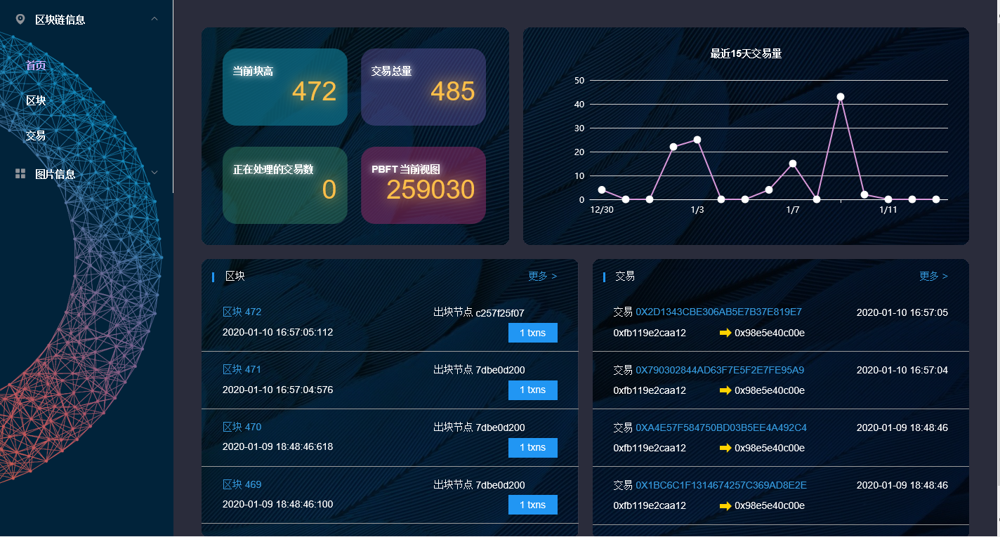
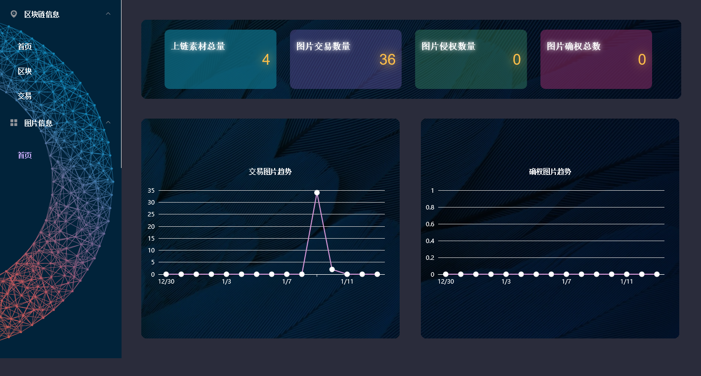

# 媒体素材——链上信息可视化1.0 文档

## 一、产品简介

### 1、描述

前端团队基于vue-cli前端框架在fisco-bcos-browser-front基础上进行修改，开发出类似于fisco-bcos-browser-front的媒体素材——链上信息可视化新版本

区块链浏览器将区块链中的数据可视化，并进行实时展示。方便用户以Web页面的方式，获取当前区块链中的信息。而修改后的浏览器主要增加区块链中个性化数据的展示，以满足各种业务需求和区块链中交易的监管。

### 2、功能

#### 2.1、区块链信息展示

主要功能是区块链概览，查看区块，查看交易，上传并编译发送交易的合约后，可以查看交易的inputs和event解码数据。区块链概览，查看区块，查看交易和节点配置页面每10s执行一轮请求。



#### 2.2、媒体素材信息展示

媒体素材信息展示主要包括，上联素材总量，图片交易数量，图片侵权数量，图片确权总数，近14天交易图片数量走势图，近14天确权图片数量走势图



## 二、部署说明

### 1、开发环境搭建

#### 1.1、安装依赖包

从代码库拉下[代码](https://github.com/xiezy0/fisco-bcos-browser-front)后，将代码放入新建的project文件夹下，可以在命令行工具（Windows是cmd，苹果是终端控制）切到项目下面。

\> 切换到项目目录（可自行选择目录）：

  cd D:\project\fisco-bcos-browser-front

\> 使用命令：

```
 npm install
```

\> 修改依赖：

  在node_modules中找到依赖包`require-from-string`，修改`index.js`文件第2行

```
 var Module = require("module");
```

  改为

```
  var Module = module.constructor;
```

#### 1.2、项目启动

\> 在项目根目录使用命令：

```
 npm run dev
```

\> 控制台出现：

  Listening at http ://localhost:8080

\> 在浏览器输入"http ://localhost:8080"。

\> 默认端口是8080，可在config文件夹index.js中修改。

```
dev: {

      env: require('./dev.env'),

      port: process.env.PORT || 8080,  //项目启动端口

      autoOpenBrowser: true,

      assetsSubDirectory: 'static',

      assetsPublicPath: '/',

      proxyTable: {

        '/api': {

          target: "http://xx.xx.xx.xx:xxxx/",  //跨域地址配置

          changeOrigin: true,

          pathRewrite: {

            '^/api': '/'

          }

        }

      },
```

#### 1.3、跨域配置

在config文件夹index.js中，在dev中的proxyTable修改，修改地址即可,请求的url路径必须加上前缀。

\> 例如：请求路径：

  http ://xx.xx.xx.xx:xxxx/home/login

\> 代理后请求路径修改为：

  /api/home/login

#### 1.4、模拟数据

模拟数据在mock.js中，在开发联调前使用，使用中注意mock.js的url和axios请求的url要保持一致。

注意：开发时将mian.js中加上mock.js引用，打包时需要注释mock.js的引用。

\> axios请求地址：

  GET_TBBLOCK_CHAIN_INFO: `/fisco-cc-browser-page/home/getTbBlockChainInfo.json`, //url和下面mock.js相同

  GET_TXNBY_LASTFOURTEENDAY: `${api}/home/getTxnByLastFourteenDay.json`, //使用mock.js这种写法无效

  GET_TBBLOCK_INFO: `${api}/block/getTbBlockInfoByPage.json`, //使用mock.js这种写法无效

\> mock.js地址：

```
  Mock.mock('/fisco-cc-browser-page/home/getTbBlockChainInfo.json',function (req,res) {   //url和上面axios相同

     return {

       "status":0,

       "msg":"success",

       "data":{"pkId":1,

         "lastBlock":17,

         "transactionNumber":17,

         "pendingTxn":0,

         "pbftView":9768,

         "avgTime":100.00

       }

     }

  });
```

\> main.js引用mock.js：

```
Vue.use(ElementUI);

  // require('./mock')  //直接require引入，开发时放开注释，打包时注释

  /* eslint-disable no-new */

  new Vue({

   el: '#app',

   router,

   template: '<App/>',

   components: { App }

  })
```

### 2、项目打包部署

#### 2.1、项目打包

\> 切换到项目根目录，执行命令：

```
npm run build
```

\> 进行打包，生成打包文件dist，在项目根目录下。

#### 2.2、部署

参考官方文档[FISCO-BCOS 前端](https://fisco-bcos-documentation.readthedocs.io/zh_CN/latest/docs/browser/server.htmlv)

## 三、源码解析

### 1、前端文件目录

```
  │ .babelrc  // ES6语法编译配置
  │ .editorconfig  // 定义代码格式
  │ .postcssrc.js
  │ dist.zip     //已打包好的项目
  │ index.html        //项目入口
  │ package-lock.json
  │ package.json   // 项目基本信息
  │ README.md   // 项目说明
  │
  ├─build    //项目构建(webpack)相关代码
  │   build.js  // 生产环境构建代码
  │   check-versions.js  // 检查node&npm等版本
  │   dev-client.js    // 热加载相关
  │   dev-server.js    // 构建本地服务器
  │   utils.js     // 构建配置公用工具
  │   vue-loader.conf.js   // vue加载器
  │   webpack.base.conf.js  // webpack基础环境配置
  │   webpack.dev.conf.js   // webpack开发环境配置
  │   webpack.prod.conf.js   // webpack生产环境配置
  │
  ├─config    // 项目开发环境配置相关代码
  │   dev.env.js  // 开发环境变量
  │   index.js   //项目一些配置变量
  │   prod.env.js   // 生产环境变量
  │
  │
  ├─src  // 源码目录
  │ │ App.vue  // 页面入口文件（根组件）
  │ │ main.js  // 程序入口文件（入口js文件）
  │ │ mock.js  //模拟数据
  │ │
  │ ├─api //请求相关文件
  │ │   api.js  //相关请求函数，`备注：由于需要兼容ie9，此文件未被使用`，
  │ │   http.js  //axios配置，`备注：由于需要兼容ie9，此文件未被使用`，
  │ │   url.js  //url路径
  │ │
  │ ├─assets //静态文件
  │ │ │
  │ │ ├─css
  │ │ │   layout.css
  │ │ │   public.css
  │ │ │
  │ │ └─images
  │ │     head-bg.jpg
  │ │     header-ng.png
  │ │     logo.png
  │ │     s-right.png
  | |     barBackground.png
  | |     1.jpg
  | |     starBackGround.jpg
  │ │
  │ ├─components  // vue公共组件
  │ │   chart.vue
  │ │   config-model.vue
  │ │   content-nav.vue
  │ │
  │ ├─router //路由配置文件
  │ │   index.js
  │ │
  │ ├─util //公共方法和常量
  │ │   constant.js //常量
  │ │   util.js  //公共方
  │ │
  │ └─views //视图组件
  │   ├─components  //页面组件
  │   │   block.vue
  │   │   blockDetail.vue
  │   │   home.vue
  │   │   nodeConfig.vue
  │   │   pendingTransaction.vue
  │   │   pendingTransactionDetail.vue
  │   │   transaction.vue
  │   │   transactionDetail.vue
  |   |   pictureHome.vue
  │   │
  │   └─layout //布局组件
  │       header.vue
  │       main.vue
  │
  └─static
```

### 2、部分更新后的源码解析

#### 2.1、新增路由

app.js代码片段如下

```
 GET_PICTURE_DATAAMOUNT: `${api}/transaction/getDataAmount`,//上联素材数量

  GET_PICTURE_GETTRADE: `${api}/transaction/getTrade`,//交易数量

  GET_PICTURE_GETCOPY: `${api}/transaction/getCopy`,//侵权数量

  GET_PICTURE_GETAUTH: `${api}/transaction/getAuth`,//确权数量

  GET_PICTURE_DATALATELY: `${api}/transaction/dataLately`,//上联素材走势

  GET_PICTURE_TRADELATELY: `${api}/transaction/tradeLately`,//交易走势
```

#### 2.2、AJAX封装路由

这里以`${api}/transaction/tradeLately`路由为例，附上相关代码片段

http.js代码片段如下

```
export function get(options) {
  return new Promise((resolve, reject) => {
     axiosIns(options).then(response => {
       resolve(response)
     })
       .catch(error => {
         reject(error)
       })
  })
};
```

url.js代码片段如下

```
export function gettradelately(data,list) {
  const params = reviseParam(data, list);
  return get({
     url:           `${url.GET_PICTURE_TRADELATELY}/${params.str}`,
     method: 'get',
     params: params.querys
  })
}
```

#### 2.3、用e-chart可视化工具制作走势图

> 以交易走势图为例，在pictureHome.vue用javascript封装html文档

```
<v-chart
        ref="linechart"
        :type="'line'"
        :id="'homeId'"
        :data="tradelately.date"
        :transactionDataArr="tradelately.dataArr"
        :size="tradelately.chartSize"
        :title="'home'"
        style="position:relative;left:-30px"
      ></v-chart>
```

> 引入封装好的方法

```
import {getdatalately} from "@/api/api";
```

> 引入js  window.setInterval()方法，设置html代码块自动刷新机制，利用js 分析并获取ajax响应的数据

```
searchgettradelately: function() {

   this.tradelately.show = false;

   this.loading2 = true;

   this.tradelately.date = [];

   this.tradelately.dataArr = [];

   let data = {

     groupId: this.groupId,

     dateTimeEnd: dataTimeEnd,

     dateTimeBegin: dateTimeBegin

   };

   gettradelately(data, {}).then(res => {

      console.log("交易数据");

      console.log(res);

      this.loading2 = false;

      if (res.data.code === 0) {

        if (res.data.data && res.data.data.length) {

        res.data.data = intiDate(res.data.data);

        for (let i = 0; i < res.data.data.length; i++) {

         this.tradelately.date.push(res.data.data[i].dateStr);

         this.tradelately.dataArr.push(res.data.data[i].txn);

        }

      } else {

        res.data.data = intiDate(res.data.data);

        for (let i = 0; i < res.data.data.length; i++) {

         this.tradelately.date.push(res.data.data[i].dateStr);

         this.tradelately.dataArr.push(res.data.data[i].txn);

        }

       }

       this.tradelately.show = true;

      } else {

       this.tradelately.show = true;

       message(errorcode[res.data.code].cn, "error");

      }

     }).catch(err => {

      this.clear();

      this.loading2 = false;

      if (err.response && err.response.status !== 200) {

       message(constant.ERROR, "error");

      }

      this.tradelately.show = true;

     });

  },
```

> 后面便可以在相关源码的组件chart.vue中进行走势图制作

#### 2.4、相关版本介绍

```
{
  "name": "fisco-bcos-browser",
  "version": "2.0.0",
  "description": "vue project",
  "author": "xdlr",
  "private": true,
  "scripts": {
    "dev": "node build/dev-server.js",
    "start": "npm run dev",
    "build": "node build/build.js"
  },
  "dependencies": {
    "ace-builds": "^1.4.3",
    "ace-mode-solidity": "^0.1.1",
    "axios": "^0.18.0",
    "babel-polyfill": "^6.26.0",
    "echarts": "^4.1.0",
    "element-ui": "^2.3.9",
    "es6-promise": "^4.2.5",
    "module": "^1.2.5",
    "solc": "^0.4.25",
    "vue": "^2.4.2",
    "vue-clipboard2": "^0.3.0",
    "vue-json-viewer": "^2.0.6",
    "vue-router": "^2.8.1"
  },
  "devDependencies": {
    "autoprefixer": "^7.1.2",
    "babel-core": "^6.22.1",
    "babel-loader": "^7.1.1",
    "babel-plugin-transform-runtime": "^6.22.0",
    "babel-preset-env": "^1.3.2",
    "babel-preset-es2015-ie": "^6.7.0",
    "babel-preset-stage-2": "^6.22.0",
    "babel-register": "^6.22.0",
    "chalk": "^2.0.1",
    "connect-history-api-fallback": "^1.3.0",
    "copy-webpack-plugin": "^4.0.1",
    "css-loader": "^0.28.0",
    "es6-promise": "^4.2.4",
    "eventsource-polyfill": "^0.9.6",
    "express": "^4.14.1",
    "extract-text-webpack-plugin": "^3.0.0",
    "file-loader": "^1.1.4",
    "friendly-errors-webpack-plugin": "^1.6.1",
    "html-webpack-plugin": "^2.30.1",
    "http-proxy-middleware": "^0.17.3",
    "mockjs": "^1.0.1-beta3",
    "opn": "^5.1.0",
    "optimize-css-assets-webpack-plugin": "^3.2.0",
    "ora": "^1.2.0",
    "portfinder": "^1.0.13",
    "rimraf": "^2.6.0",
    "semver": "^5.3.0",
    "shelljs": "^0.7.6",
    "url-loader": "^0.5.8",
    "vue-loader": "^13.0.4",
    "vue-style-loader": "^3.0.1",
    "vue-template-compiler": "^2.4.2",
    "webpack": "^3.6.0",
    "webpack-bundle-analyzer": "^3.3.2",
    "webpack-dev-middleware": "^1.12.0",
    "webpack-hot-middleware": "^2.18.2",
    "webpack-merge": "^4.1.0"
  },
  "engines": {
    "node": ">= 4.0.0",
    "npm": ">= 3.0.0"
  },
  "browserslist": [
    "> 1%",
    "last 2 versions",
    "not ie <= 8"
  ]
}
```

